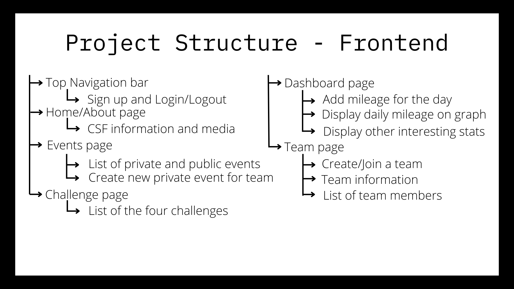
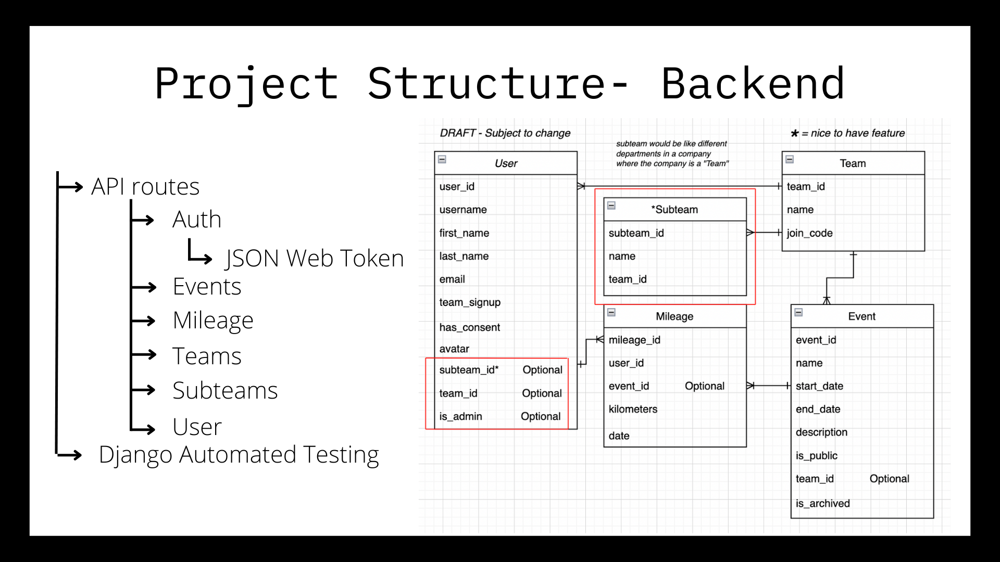

# CSF Winter 2023

## Project Overview

The objective is to re-energise Stride for Education, so it better caters to users and is less resource demanding to administer.

Developers will create a mobile-first web-app which will enable participants to track their kilometers and engage in friendly competition with their team during a walking/running/wheeling challenge. Through the app, we aim to raise funds and awareness for Community Spirit Foundation. 

### When and where the app will be used 
- Previously the event was run once a year, but this app will allow for a more "off-the-shelf" approach so that public and private events can be created at any time.
- Sponsors and schools
    - Sponsors' staff will use the app to engage with CSF
    - Teachers will be able to sign up their class

## Project Requirements

### Minimal Viable Product

- Users can sign up and log in, with the opportunity to sign up as a team. (e.g., teachers can sign up on behalf of their class)
    - Capture consent from users to use their details
    - Users can select an avatar out of the given choices
- Users can create/join a team and create private events
- An 'About Us' page that shows CSF information and media to users with signup/login buttons
- A 'Dashboard' page with a mileage graph for returning users and an ability to manually add mileage for the day
- A static 'Challenges' page that shows a list of challenges
- An 'Events' page that shows a list of public and private events
- Dashboard to allow administration staff to create and update events
- Admins can export participant data into an Excel spreadsheet
- Link to external website to raise funds and link to social media pages

### Site Breakdown

## Technologies

Frontend

- Client
    - [Vue3 (Composition API)](https://vuejs.org/)
    - [TypeScript](https://www.typescriptlang.org/)
    - [Pinia (State Manager)](https://pinia.vuejs.org/)
    - [Vuetify (UI Components Library)](https://vuetifyjs.com/en/)
- Testing
    - [Cypress](https://www.cypress.io/)
- Linting
    - [ESLint](https://eslint.org/)
- Formatting
    - [Prettier](https://prettier.io/)

Backend

- Web Server
    - [Django](https://www.djangoproject.com/)
- Database
    - [PostgreSQL](https://www.postgresql.org/)
- Linting
    - [flake8](https://flake8.pychond.org/)

Other

- [Docker](https://www.docker.com/)
- [MkDocs](https://www.mkdocs.org/)

## Style Guide and Branding

See [this guide](https://drive.google.com/file/d/1kAWqTCt_j9zyLtmKWeBiV-Fk5ybMYDhV/view?usp=sharing) for a quick overview of logos, colours, and typography.

See [this folder](https://drive.google.com/drive/folders/1auwjbas9B0eKndSAQdmVk-J9NXTrohL_?usp=share_link) for media assets such as avatars, fonts, and videos.

See [this document](https://docs.google.com/document/d/15tQjiH7VnaAhLnafIznboitilpdyP6Wl/edit?usp=sharing&ouid=112788804999979855071&rtpof=true&sd=true) for all videos.

## Code Conventions

### Linting
- Be sure to enable {format on save} on VS Code

### Naming Conventions

- `.py` files
    - variable names in snake case e.g., `variable_name`
    - class names in pascal case e.g., `ClassName`
    - file name in lowercase e.g., `filename.py`
- `.vue` files
    - file name in pascal case e.g., `FileName.vue`
- `.ts` files
    - variable names in camel case e.g., `variableName`
    - file name in lowercase e.g., `filename.ts`

### Documentation
- Code should be documented